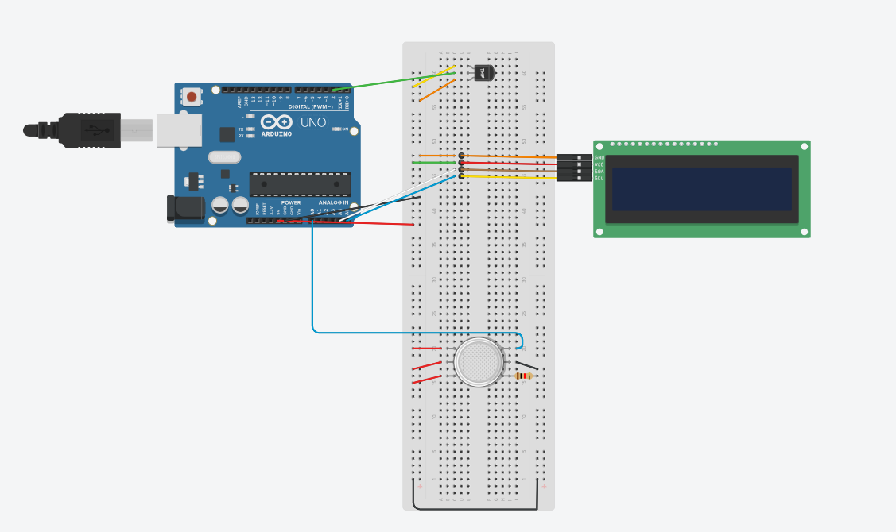
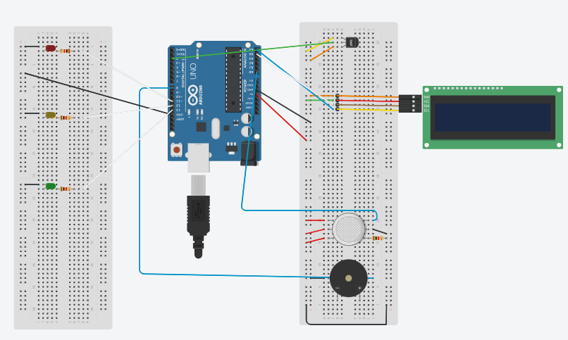
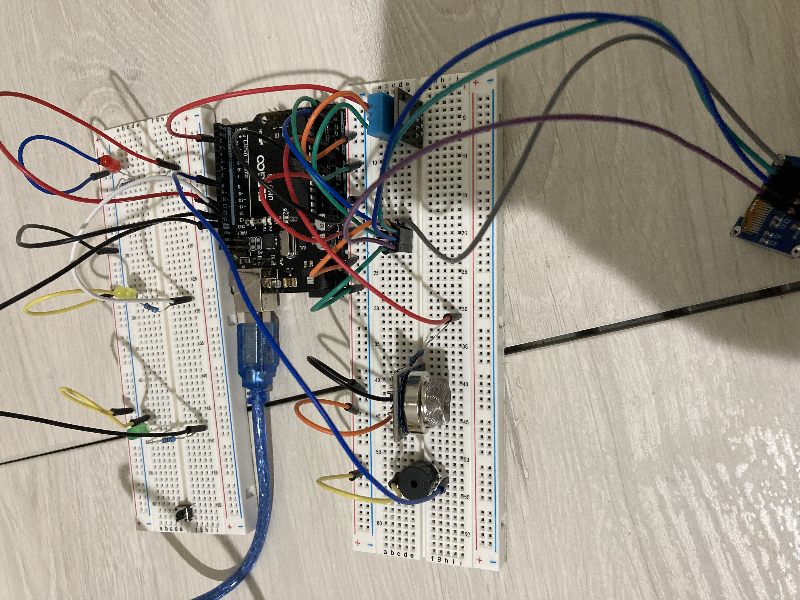

# BlueStamp - The Air Quality Monitor
There are many humans in risk of death or severe illness due to poor air quality. These people don't even know wether they live in clean or polluted areas. The reason I chose this Air Quality monitor is because I wanted to make something that can actually be used in real life. This Air quality monitor can help people identify wether or not they live in good coniditions and make a descion based on the information they are getting. Throughout this project, I have learned a lot of new skills, like breadboarding, wiring, coding, and, in general, better knowledge of how each component works. But the most important skill I learned is determination, and how to continue trying when things go wrong. Overall, I had a great expeirence with BlueStamp and engineering, which I'll show you in depth below. 


| **Engineer** | **School** | **Area of Interest** | **Grade** |
|:--:|:--:|:--:|:--:|
| Ashwath S | Northwood High School | Electronic Engineering | Incoming Sophmore

**Replace the BlueStamp logo below with an image of yourself and your completed project. Follow the guide [here](https://tomcam.github.io/least-github-pages/adding-images-github-pages-site.html) if you need help.**


  
# Final Milestone

**Don't forget to replace the text below with the embedding for your milestone video. Go to Youtube, click Share -> Embed, and copy and paste the code to replace what's below.**

<iframe width="560" height="315" src="https://www.youtube.com/embed/F7M7imOVGug" title="YouTube video player" frameborder="0" allow="accelerometer; autoplay; clipboard-write; encrypted-media; gyroscope; picture-in-picture; web-share" allowfullscreen></iframe>

For your final milestone, explain the outcome of your project. Key details to include are:
- What you've accomplished since your previous milestone
- What your biggest challenges and triumphs were at BSE
- A summary of key topics you learned about
- What you hope to learn in the future after everything you've learned at BSE


# Second Milestone


<iframe width="873" height="491" src="https://www.youtube.com/embed/Hgh8jh2m8U4" title="Ashwath S. Milestone 2" frameborder="0" allow="accelerometer; autoplay; clipboard-write; encrypted-media; gyroscope; picture-in-picture; web-share" allowfullscreen></iframe>


From my second milestone, I have added an OLED Screen where the Air Quality, Temperature, and Humidity are being displayed instead of being in a computer. With the ground and 5V power wires already established, I connected the positive (for the 5V) and the negative (for the ground) ends of the breadboard with jumper wires and connected them to their repsectives rows to charge the OLED Screen. The Screen also required and analog input of A4 and A5 for the SCL and SDA. Then, I added code making conditionals for the for the air quality; if below 100, the air quality is great, if above 100 but less than 181, then its good, if above 181 but less than 225 then poor, and etc. Then, I defined my fonts and made code for how the text will be displayed on screen, when it will be displayed, and what is going to be displayed there. My biggest constraint was that I was consitantly getting inaccurate reading, like it my air quality (only) would show that the air qualiy is toxic when I know it clearly is not. But I resolved this problem by adding a resistor, so that the air quality sensor wouldn't take in too much voltage power, as the resistor will "soak" some of the voltage. For my milestone 3, I work towards perfecting my project and start working heavily on cool modifications. 

# First Milestone


<iframe width="676" height="380" src="https://www.youtube.com/embed/NjfxezMAle8" title="Ashwath S. Milestone 1" frameborder="0" allow="accelerometer; autoplay; clipboard-write; encrypted-media; gyroscope; picture-in-picture; web-share" allowfullscreen></iframe>


The DHT11 and the MQ-135 air quality sensor are required for this first milestone video. A power connection with 5 volts and ground is necessary for these components. Connect the red wire to the positive rails at the breadboard's tail end to charge the column. Next, connect the green and yellow wires to the rows where the center pins of the DHT11 and MQ-135 are located. The negative railing at the breadboard's back end is where the ground wire is attached. The pins on each component's orange and blue wires should be connected. The red wire in the MQ-135 is linked from the analog input A0 in the controller board, and the third yellow wire in the DHT11 is connected from the digital 2 input in the R3 controller board to the DHT11's leftmost pin. The Adafruit DHT library was included to link the code to the parts. The code reads air quality from the MQ-135 input and temperature, humidity, and heat index from the DHT input. Although the air quality is not quite right now, it should improve as the project goes on.

# Schematics 

Base Project Schematics:



Entire Project With Modifications Schematics:


*Tinkercad doesn't have the latest version of the LCD screen, the mq135 gas sensor, and the dht11 module, so the wiring is different here than compared to my actual project. But this is what the wiring would be like if I had those versions of those particular parts.

What I've Built: 



# Code
Here's where you'll put your code. The syntax below places it into a block of code. Follow the guide [here]([url](https://www.markdownguide.org/extended-syntax/)) to learn how to customize it to your project needs. 

```c++
#include <SPI.h>
#include <Wire.h>
#include <Adafruit_GFX.h>
#include  <Adafruit_SSD1306.h>
#include <Fonts/FreeSans9pt7b.h>
#include <Fonts/FreeMonoOblique9pt7b.h>
#include  <DHT.h>
#define SCREEN_WIDTH 128
#define  SCREEN_HEIGHT 64 

#define OLED_RESET     4   
Adafruit_SSD1306 display(SCREEN_WIDTH,  SCREEN_HEIGHT, &Wire, OLED_RESET);

#define sensor    A0 
#define DHTPIN  2          
#define DHTTYPE DHT11     

int gasLevel  = 0;         
String quality =""; 
DHT dht(DHTPIN,  DHTTYPE);

int buzzerPin = 8;

void sendSensor()
{
  float h = dht.readHumidity();
  float t = dht.readTemperature();
  t = t * 1.8 + 32 ;

  if (isnan(h) || isnan(t)) {
  Serial.println("Failed  to read from DHT sensor!");
    return;
    
  }
  display.setTextColor(WHITE);
  display.setTextSize(1);
  display.setFont();
  display.setCursor(0, 43);
  display.println("Temperature: ");
  display.setCursor(80, 43);
  display.println(t);
  display.setCursor(114, 43);
  display.println("F");
  display.setCursor(0,  56);
  display.println("Humidity: ");
  display.setCursor(80, 56);
  display.println(h);
  display.setCursor(114, 56);
  display.println("%");
}

void air_sensor()
{
  gasLevel = analogRead(sensor);

  if(gasLevel<100){
    quality = "GREAT!";
  }
  else if (gasLevel >= 100 && gasLevel<181){
    quality =  "GOOD!";
  }
   else if (gasLevel >= 181 && gasLevel<225){
    quality =  "Poor!";
  }
  else if (gasLevel >= 225 && gasLevel<300){
    quality  = "BAD!";
  }
    else if (gasLevel >= 300 && gasLevel<350){
    quality  = "Toxic";
  }
    else{
    quality = "Wrong";   
}

  display.setTextColor(WHITE);
  display.setTextSize(1);  
  display.setCursor(1,5);
  display.setFont();
  display.println("Air Quality:");
  display.setTextSize(1);
  display.setCursor(10,23);
  display.setFont(&FreeMonoOblique9pt7b);
  display.println(quality + "(" + gasLevel + ")");  
  delay(5000);

  if (gasLevel>225) {
    Serial.println(gasLevel);
    tone(buzzerPin, 440);
    delay(1000);

    tone(buzzerPin, 494);
    delay(1000);

    tone(buzzerPin, 523); 
    delay(1000);

    tone(buzzerPin, 587); 
    delay(1000);

    tone(buzzerPin, 659); 
    delay(1000);

    tone(buzzerPin, 698); 
    delay(1000);

    tone(buzzerPin, 784); 
    delay(1000);

    noTone(buzzerPin);
    delay(1000);
  }

  if (gasLevel<181) {
    Serial.println(gasLevel);
    digitalWrite(13, HIGH);
    delay(1000);
    digitalWrite(13, LOW);
    delay(1000);
  }
  else if (gasLevel >= 181 && gasLevel < 225) {
    Serial.println(gasLevel);
    digitalWrite(12, HIGH);
    delay(2000);
    digitalWrite(12, LOW);
    delay(2000);
  }
  else {
    digitalWrite(11, HIGH);
    delay(2000);
    digitalWrite(11, LOW);
    delay(2000);
  }
}


void setup() {
  Serial.begin(9600);
  pinMode(sensor,INPUT);
  pinMode(buzzerPin, OUTPUT);
  tone(buzzerPin, 1000, 2000);
  pinMode(13, OUTPUT);
  pinMode(12, OUTPUT);
  pinMode(11, OUTPUT);
  dht.begin();
  if(!display.begin(SSD1306_SWITCHCAPVCC, 0x3c)) { 
    Serial.println(F("SSD1306 allocation failed"));
}
  display.clearDisplay();
  display.setTextColor(WHITE);
  
  display.setTextSize(2);
  display.setCursor(50, 0);
  display.println("Air");
  display.setTextSize(1);
  display.setCursor(23, 20);
  display.println("Quality monitor");
  display.display();
  delay(1200);
  display.clearDisplay();
  
  display.setTextSize(1);
  display.setCursor(20, 20);
  display.println("BY Ashwath S.");
  display.display();
  delay(2000);
  display.clearDisplay();  
}

void loop() {
display.clearDisplay();
air_sensor();
sendSensor();
display.display();  
}

```

# Bill of Materials 

| **Part** | **Note** | **Price** | **Link** |
|:--:|:--:|:--:|:--:|
| UNO R3 Controller Board | This is the "powerhouse" of my poject; contains the VCC and Ground power, as well as numerous ananlog and digital inputs that are nesscary for numerous components | $16.99 | <a href="https://a.co/d/5OrLeQE/"> Link </a> |
| 830 Tie-Points Breadboard | Powers up the components, it's the area where you "work" in | $9.99 | <a href="https://a.co/d/5oY5jsG/"> Link </a> |
| 0.96" OLED Module | Displays the Air Quality, Temeprature and Humidity readings from the MQ135 and the DHT11 | $6.99 | <a href="https://a.co/d/eRnV0wp/"> Link </a> |
| DHT11 Temperature and Humidity Module| A component that reads  temperature, humidity and heat index in a given area | $7.99 | <a href="https://a.co/d/j9o82sl/"> Link </a> |
| MQ135 Air Quality Sensor | This component reads the gas level in the current area and outputs it as an analog value | $3.99 | <a href="https://a.co/d/iWFomzP/"> Link </a> |
| Breadboard Jumper Wire | Conects pins in different components to its nesscary (analog or digital) input and the power needed (5V or Ground) | $6.99 | <a href="https://a.co/d/14zhDB1/"> Link </a> |
| Female-to-Male Dupont Wire | Connect pins in OLED Screen to same rows where the analog inputs and ground/5v power are, allowing OLED to strech and be more visible to users | $3.99 | <a href="https://a.co/d/5k2gFZq/"> Link </a> |
| Passive Buzzers | Outputs a rythimic buzzing sound; used in my project as an alarm for people to be notified if the air quality starts to become bad| $7.28 | <a href="https://a.co/d/dd3wbt5/"> Link </a> |
| Resistors (10K)| "Soaks" some of the volatage or ground power, sends the remaining to component (which is the led lights for my project)| $5.99 | <a href="https://a.co/d/1YIcyh2/"> Link </a> |
| LED Lights| Made a mini circuit where either a red, green, or yellow LED light will blink based on how good/bad the air quality currently is | $5.99 | <a href="https://a.co/d/3pzpUCf/"> Link </a> |
